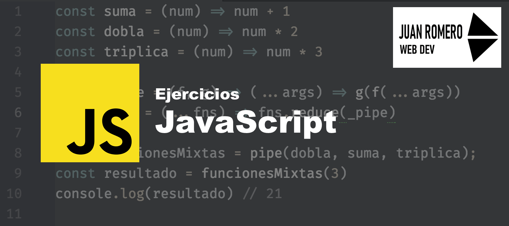

# Bienvenido a mi repositorio de ejercicios de _JavaScript_

## Intro
Hola que tal, mi nombre es Juan Carlos Romero, en este repositorio encontraras todos los ejercicios que he resuelto utilizando el lenguaje de programacion JavaScript en su forma base, es decir Vanilla JS.

Aqui habran ejercicios de los siguientes temas:
* Fundamentos de JS
* Bucles y condicionales
* Arreglos
* _POO_
* Asincronia
* _DOM_
* _JSON_
* _AJAX_

Todos estan guardados en sus respectivos folders, en cuyo contenido encontraras:

* Codigo de la solucion.
* Paginas Markdown, donde explico paso a paso la resolucion desde su planteamiento hacia su traslado de codigo.
* Enlaces complementarios de ayuda.

## Enlaces

* [Mi canal de youtube](https://www.youtube.com/channel/UCoAyQ6ZZidzR3u4vCoycvIw)

* [Revisa mis otros repositorios](https://github.com/juanromerodev?tab=repositories)

>**_"El que aprende y aprende y no practica lo que sabe es como el que ara y ara y no siembra"_**
>_-Platon_

[🔼](#bienvenido-a-mi-repositorio-de-ejercicios-de-javascript)

